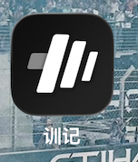
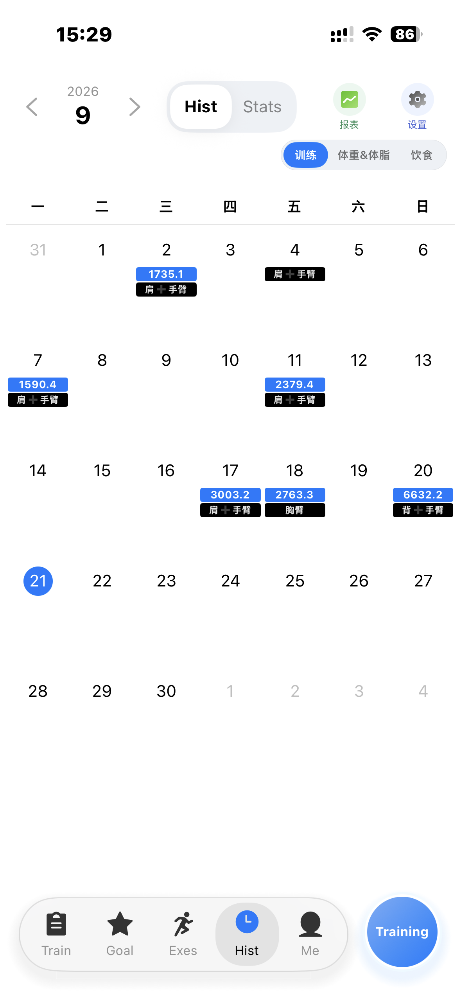
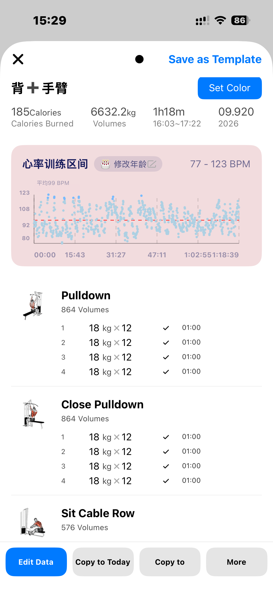
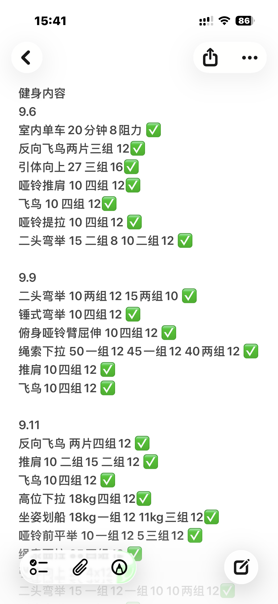
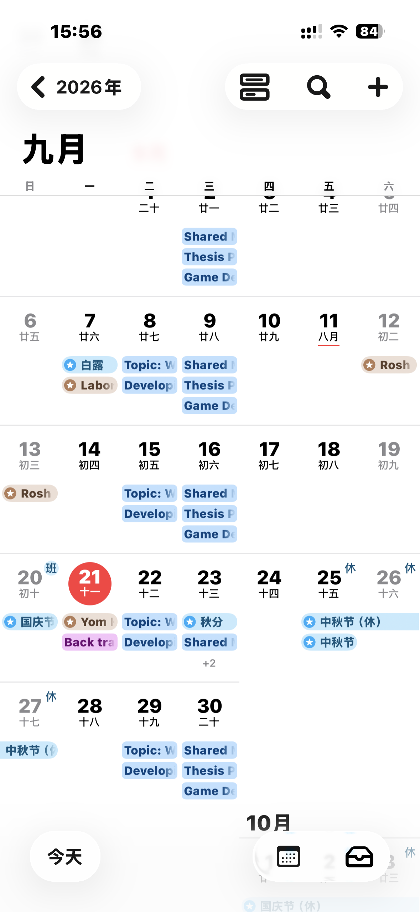

>What is one tool which you use daily or very nearly daily?  Write a short reflection consisting of:  a photo you took of this tool  
>when and how you first learned of it  
>what you would use if this things did not exist

The tool I use very nearly daily is an app called "XunJi".Basically, it’s an app that helps me log my gym sessions and build training plans. I can easily view my training laid out in a weekly schedule. This helps me understand my training progress better and also motivates me to work out more just to fill up that weekly schedule.

But this isn’t the main reason I like the app. I could technically track everything in my iPhone Calendar too, but I prefer not to. My calendar already has my class schedule and lots of other stuff. I like separating different activities into different apps, especially routine things like attending classes and going to the gym. The main reason I love it is its library of workout exercises. I can pick movements right inside the app, and each one comes with GIFs and PNG diagrams. I can instantly tell what an exercise looks like without searching online, which is handy when I just blank on the name. It also shows the weight I lifted in previous sessions, so I know exactly how much to load up even if I haven’t done that exercise in a long time. It can also track whether I’ve made progress. For example, if I can’t lift the same weight I used to, it may hint I need to hit the gym more often. Once I finish each exercise, it starts a rest timer for my sets. This stops me from zoning out or scrolling on my phone and losing track of my rest period. Even with this timer though, sometimes I still end up scrolling for way too long.

**when and how I first learned of it**  
Before I started working out regularly, I never logged my training or tracked how often I went to the gym. I found I was progressing really slowly, and I often wouldn’t realize I hadn’t worked out in ages. That’s when I started recording my workouts. At first I just typed everything in the Notes app. I was new to tracking back then and didn’t want to bother downloading a dedicated fitness app. I usually decided what body part I would train that day, then looked up workout tutorials for it once I got to the gym. I’d end up watching different videos every time, even for the same muscle group. That meant my shoulder workouts could look totally different week to week. Typing notes was faster than browsing through exercise lists inside an app — that’s something I only realized later when I tried fitness apps. At the time, I just didn’t know apps like this existed, so I stuck with Notes.

But as I went to the gym more often, I got more familiar with exercises for each muscle group. My workout routine became pretty fixed, and I no longer needed to follow new tutorials every session. That’s when Notes started feeling cumbersome. Every time I trained, I had to copy my previous log for that muscle group and delete all the checkmarks I’d marked last time. I hopped on social media to look for better logging apps, and that’s how I found XunJi. Since I often scroll for fitness content online, I also kept seeing fitness creators posting recommendations for it. After seeing those posts a few times, I decided to download it and give it a try. The big selling points for me: its core features are free, the interface is clean, its fitness tools feel professional, and it doesn’t come loaded with unnecessary extra functions.

I fell in love with the app after using it for a while. The only downside is that features for logging meals and calculating calories sit behind a paywall. Since I didn’t want to pay for that, I track my diet separately in another app.

**what I would use if this things did not exist**
As I mentioned earlier, I used my phone’s Notes app before I found XunJi. But as I kept training, logging new workouts in Notes got more and more tedious, and there was no simple weekly view to see my training patterns. Even without this app, I could still use my phone’s built-in Calendar. I can assign different categories with distinct colors, so I can easily spot my gym sessions alongside all my other calendar events. I tested this: I created a purple category just for training entries. For detailed workout notes, I can write everything inside the event description. If I use the same title for training the same muscle group next time, I can directly copy the whole previous entry including its notes. This function is actually the most important part for me. I don’t stick to fixed training days for specific muscle groups, so being able to copy my last workout log for that body part easily matters the most.

With that in mind, XunJi’s truly irreplaceable features are the exercise GIFs and the set rest timer. Of course, logging weights and reps is more straightforward in XunJi too, since it’s purpose-built for gym tracking.

